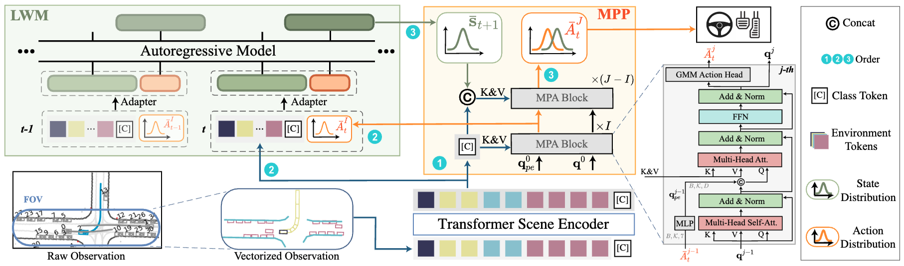

This is the official repository of 

# Learning Multiple Probabilistic Decisions from Latent World Model in Autonomous Driving

<p align="left">
<a href="https://sephirex-x.github.io/LatentDriver/">

</a>
<a href='https://arxiv.org/pdf/2409.15730' style='padding-left: 0.5rem;'>
    
</a>
</p>





🔥Powered by [Hydra](https://hydra.cc/docs/intro/), [Pytorch-lightinig](https://lightning.ai/docs/pytorch/stable/), [Tensorboard](https://github.com/tensorflow/tensorboard) and [Waymax](https://github.com/waymo-research/waymax).

Authors: *Lingyu Xiao, Jiang-Jiang Liu, Sen Yang, Xiaofan Li, Xiaoqing Ye, Wankou Yang and Jingdong Wang*

## 💡 Highlights

- The first open-source planner verfied on [Waymax](https://github.com/waymo-research/waymax).

- Integrated Jax-based close-loop simulation with torch-based model training. (Supported parallel in GPUs)

- Full pipeline to kick-start on waymax, data collecting, model training and simulation.

- Expert-level performance under the close-loop evaluation.

## 📝 Abstract

The autoregressive world model exhibits robust generalization capabilities in vectorized scene understanding but encounters difficulties in deriving actions due to insufficient uncertainty modeling and self-delusion. In this paper, we explore the feasibility of deriving decisions from an autoregressive world model by addressing these challenges through the formulation of multiple probabilistic hypotheses. We propose LatentDriver, a framework models the environment’s next states and the ego vehicle’s possible actions as a mixture distribution, from which a deterministic control signal is then derived. By incorporating mixture modeling, the stochastic nature of decision- making is captured. Additionally, the self-delusion problem is mitigated by providing intermediate actions sampled from a distribution to the world model. Experimental results on the recently released close-loop benchmark Waymax demonstrate that LatentDriver surpasses state-of-the-art reinforcement learning and imitation learning methods, achieving expert-level performance.

## 🛠️ Quick Start

- [Installation](docs/INSTALL.md)

- [Dataset Preparation](docs/DATASET_PREPARATION.md)

- [Training & Simulating](docs/TRAIN_EVAL.md)


## 📊 Main results and weights

The weights can be found [here](https://huggingface.co/Sephirex-x/LatentDriver/tree/main)

#### Performance under reactive agents

| Model                  | mAR[95:75] | AR[95:75] | OR   | CR   | PR    |
| ---------------------- | ---------- | --------- | ---- | ---- | ----- |
| PlanT                  | 75.86      | 87.01     | 2.29 | 3.08 | 95.38 |
| Easychauffeur-PPO      | 78.72      | 88.66     | 3.95 | 4.72 | 98.26 |
| LatentDriver(T=2, J=4) | 89.31      | 93.79     | 2.59 | 3.22 | 99.50 |
| LatentDriver(T=2, J=3) | 90.14      | 94.31     | 2.22 | 3.13 | 99.64 |

#### Performance under non-reactive agents

| Model                  | mAR[95:75] | AR[95:75] | OR   | CR   | PR    |
| ---------------------- | ---------- | --------- | ---- | ---- | ----- |
| PlanT                  | 75.34      | 87.39     | 2.15 | 3.8  | 95.11 |
| Easychauffeur-PPO      | 78.33      | 88.21     | 3.54 | 4.82 | 97.77 |
| LatentDriver(T=2, J=4) | 89.63      | 94.82     | 2.58 | 2.31 | 99.55 |
| LatentDriver(T=2, J=3) | 90.38      | 95.54     | 2.2  | 2.03 | 99.68 |

## 📈 Additional ablation studies

T and J is chose empirically according to the experiment below.

<center class="half">
    
</center>


## 🤔 Trouble Shooting

Most of the problems may be caused by the JAX environment. Here are some common problems and solutions.

Q1: The process is accidentally killed when running `preprocess_data.sh`. \
A1: You can reduce your batch size in `preprocess_data.sh` to avoid memory overflow.

Q2: "Jax [WARNING] No GPU/TPU found" when running `preprocess_data.sh`. \
A2: It is normal, when preprocessing data, we do not need GPU. You can use `python tools/quick_check.py` to check if your simulation environment is correctly set up.

Q3: During simulation, is it normal that the memory usage is high but power usage is low? \
A3: Yes, it is normal. And this need to be optimized in JAX.

## TODOs

- [ ] Training code & data for EasyChauffeur-PPO.
- [ ] Collecting and loading specific scenario for simulation.
- [x] Training code for LatentDriver and PlanT.
- [x] Weights for LatentDriver, PlanT and EasyChauffeur-PPO.
- [x] Data collecting code.
- [x] Code for identifying WOMD scene's types.

## Citation

If you find our work is useful, please consider citing and 🌟 us:

```
@article{xiao2024learning,
  title={Learning Multiple Probabilistic Decisions from Latent World Model in Autonomous Driving},
  author={Xiao, Lingyu and Liu, Jiang-Jiang and Yang, Sen and Li, Xiaofan and Ye, Xiaoqing and Yang, Wankou and Wang, Jingdong},
  journal={arXiv preprint arXiv:2409.15730},
  year={2024}
}
@article{xiao2024easychauffeur,
  title={EasyChauffeur: A Baseline Advancing Simplicity and Efficiency on Waymax},
  author={Xiao, Lingyu and Liu, Jiang-Jiang and Ye, Xiaoqing and Yang, Wankou and Wang, Jingdong},
  journal={arXiv preprint arXiv:2408.16375},
  year={2024}
}
```

## Acknowledgement

<!--ts-->

* [waymo-research/waymax](https://github.com/waymo-research/waymax)
* [sshaoshuai/MTR](https://github.com/sshaoshuai/MTR)
* [openai/gpt-2](https://github.com/openai/gpt-2)
* [kzl/decision-transformer](https://github.com/kzl/decision-transformer)
* [facebookresearch/online-dt](https://github.com/facebookresearch/online-dt)
* [autonomousvision/plant](https://github.com/autonomousvision/plant)

<!--te-->